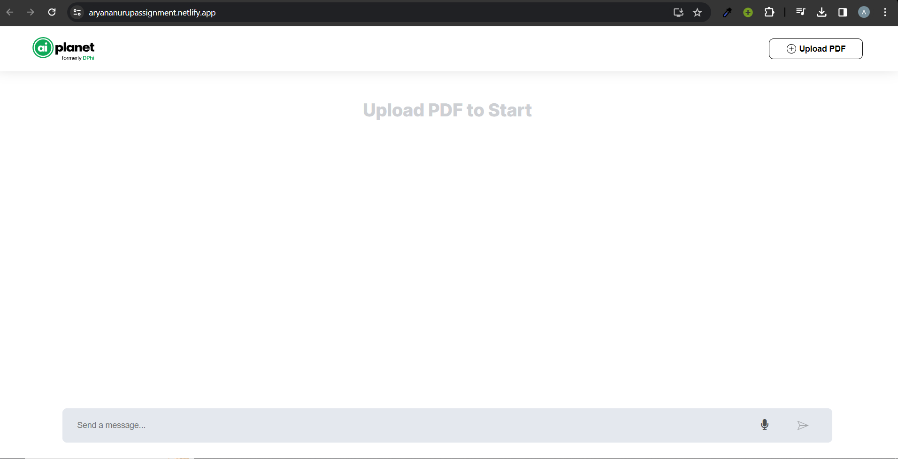
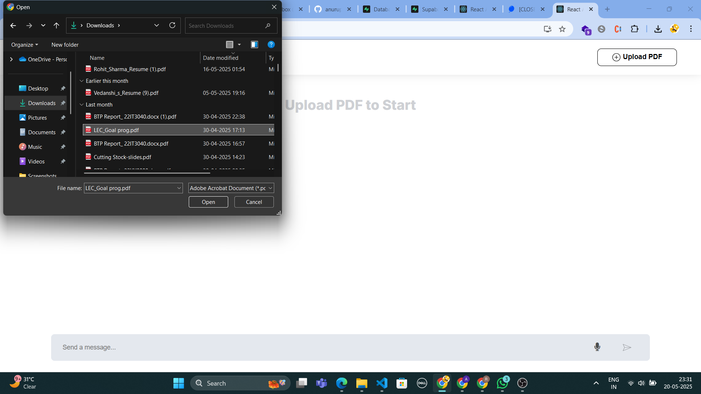
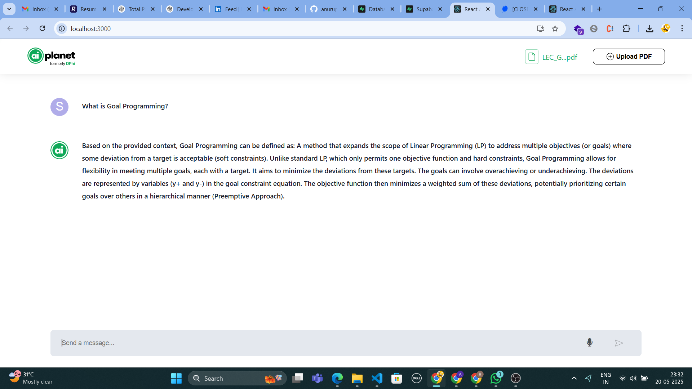
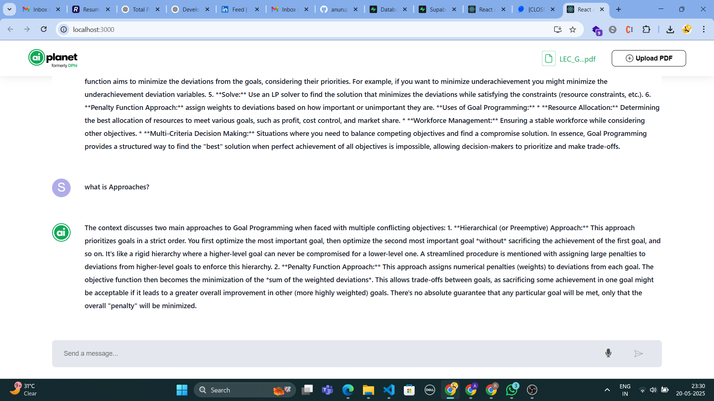

# 📄 Fullstack PDF Question Answering Application 🤖

This project is a full-stack application developed for the Fullstack Internship Assignment. It allows users to upload PDF documents and ask questions regarding their content. The backend processes these documents using natural language processing to provide answers.

## 🎯 Objective

To develop a full-stack application enabling users to:
1.  Upload PDF documents.
2.  Ask questions about the content of these uploaded documents.
3.  Receive answers generated by an NLP model.

---

## ✨ Features (Functional Requirements)

* **📄 PDF Upload**: Users can seamlessly upload PDF documents. The application stores the PDF and extracts its text content for processing.
* **❓ Question Answering**: Users can pose questions related to the content of any uploaded PDF.
* **💡 Answer Display**: The system processes the question and the PDF content to provide relevant answers.
* **🔄 Follow-up Questions**: Users can ask follow-up or new questions on the same document.

---

## 🎬 Demo Video

Watch a demonstration of the application in action:

* **[(https://drive.google.com/file/d/1CQbfwwTPbM8ADzM_XstRPO7ZWFjA9lXv/view?usp=sharing)]** (👈 *Insert your Google Drive link here*)

---

## 🛠️ Tools and Technologies

* **Backend**: FastAPI
* **NLP Processing**: LangChain / LlamaIndex (using OpenAI for language model and embeddings)
* **Frontend**: React.js
* **Database**: PostgreSQL (managed via Supabase) for storing document metadata.
* **File Storage**: Local filesystem (for uploaded PDFs).
* **PDF Text Extraction**: PyMuPDF

---

## 🚀 Getting Started

Follow these steps to set up and run the application locally:

1.  **Clone the Repository**:
    ```bash
    git clone [https://github.com/Rohit9568/AI-Planet-Assignment.git](https://github.com/Rohit9568/AI-Planet-Assignment.git)
    cd Ai-Planet-Assignment
    ```

2.  **Set Up Environment Variables**:
    Create a `.env` file in the `Backend` directory (`Backend/.env`) with the following:

    ```env
    # Backend .env file
    OPENAI_API_KEY=your_openai_api_key_here

    # Supabase (PostgreSQL) Credentials
    # These are your Supabase project's database connection details
    DB_USER=your_supabase_db_user        # e.g., postgres
    DB_PSWD=your_supabase_db_password
    DB_HOST=your_supabase_db_host        # e.g., db.yourprojectid.supabase.co
    DB_PORT=your_supabase_db_port        # e.g., 5432
    DB_NAME=your_supabase_db_name        # e.g., postgres
    ```
    * Replace placeholders with your actual OpenAI API key and Supabase database credentials.
    * No specific `.env` is mentioned for the frontend in your original README, but if your React app needs environment variables (e.g., for the backend API URL if it's not `/api`), create a `.env` file in the `Frontend` directory with `REACT_APP_` prefixes.

3.  **Install Dependencies**:

    * **Backend**:
        ```bash
        cd Backend
        pip install -r requirements.txt
        ```

    * **Frontend**:
        ```bash
        cd ../Frontend
        npm install
        ```

4.  **Run the Backend Server**:
    Navigate to the `Backend` directory:
    ```bash
    uvicorn main:app --reload
    ```
    The backend will typically run on `http://localhost:8000`.

5.  **Run the Frontend Development Server**:
    Navigate to the `Frontend` directory:
    ```bash
    npm start
    ```
    The frontend will typically run on `http://localhost:3000`.

6.  **Access the Application**:
    Open your web browser and go to `http://localhost:3000`.

---

## 🏗️ Application Architecture

The application follows a client-server architecture:


* **Frontend (React.js)**:
    * Provides the user interface for uploading PDFs and interacting with the Q&A system.
    * Handles user input (typed questions or speech-to-text).
    * Communicates with the backend via API calls.
    * Displays responses from the backend.

* **Backend (FastAPI)**:
    * **API Endpoints**: Exposes RESTful APIs for file uploads and question answering.
    * **PDF Processing**:
        1.  Receives uploaded PDF files.
        2.  Uses **PyMuPDF** to extract raw text from the PDFs.
    * **NLP Core (LangChain/LlamaIndex)**:
        1.  **Text Chunking**: Divides the extracted text into smaller, manageable chunks.
        2.  **Embeddings**: Generates vector representations (embeddings) of these text chunks using an OpenAI model.
        3.  **Vector Store**: Stores these embeddings for efficient similarity search (details of the specific vector store implementation, e.g., in-memory or a dedicated one, can be added if specified).
        4.  **Similarity Matching**: When a user asks a question, it's also converted into an embedding. The system then searches the vector store for the most semantically similar text chunks from the PDF.
        5.  **Response Generation**: The relevant chunks and the user's question are passed to a language model (OpenAI's GPT) via LangChain/LlamaIndex to generate a contextual answer.
    * **Data Management (PostgreSQL via Supabase)**:
        * Stores metadata about uploaded documents (e.g., filename, upload date, potentially a reference to the stored text or embeddings if applicable).

* **File Storage**:
    * Uploaded PDF files are stored on the **local filesystem** of the server.

---

## 📋 Backend API Endpoints

* **`POST /uploadfile/`**:
    * **Description**: Uploads a PDF document.
    * **Request Body**: `multipart/form-data` with a file field (e.g., `file`).
    * **Response**: Confirmation message and document metadata.
* **`POST /ask/`**:
    * **Description**: Receives a question related to a previously uploaded PDF and returns an answer.
    * **Request Body (JSON)**:
        ```json
        {
          "question": "Your question here",
          "document_id": "id_of_the_document_to_query" // Or filename, depending on implementation
        }
        ```
    * **Response (JSON)**:
        ```json
        {
          "answer": "The generated answer from the PDF content."
        }
        ```

*(Note: Actual request/response structures might vary slightly based on your specific implementation. Update as needed.)*

---

## 📈 Non-Functional Requirements Met

* **Usability**: The interface is designed to be intuitive, following the provided Figma design for ease of navigation.
* **Performance**:
    * Text extraction and chunking are performed upon upload.
    * Embeddings and similarity search are optimized for quick retrieval of relevant context for answering questions.
    * FastAPI is chosen for its high-performance capabilities.

---

## 💻 Usage Guide

1.  **Navigate to the application** in your browser.
    

2.  **Upload a PDF document**: Click the upload area or button to select a PDF file.
    

3.  **Wait for processing**: The system will process the PDF and prepare it for questioning.
    

4.  **Ask questions**: Once the PDF is ready, type your question into the chat interface or use the microphone icon for speech-to-text.
    

5.  **Receive answers**: The application will display the answer based on the PDF's content.
    

6.  **Ask follow-up questions**: Continue the conversation by asking more questions about the same document.

---

## 🌟 Evaluation Criteria Addressed

* **Functionality**: All specified functional requirements (PDF upload, Q&A, follow-ups) are implemented.
* **Code Quality**: The source code is structured into `Frontend` and `Backend` directories, with comments where necessary.
* **Design and UX**: The UI is based on the provided Figma design to ensure a user-friendly experience.
* **Innovation**: The addition of speech-to-text enhances usability.

---

## 🤝 Contributing

Contributions, issues, and feature requests are welcome! Please feel free to check the [issues page](https://github.com/Rohit9568/AI-Planet-Assignment/issues).

---

## 📄 License

This project is licensed under the MIT License. See the `LICENSE` file for more details.

---

## 🙏 Acknowledgments

* Thanks to **AI Planet** for the internship assignment.
* Special thanks to **OpenAI** for their powerful language models and embedding APIs.
* The **LangChain** and **LlamaIndex** communities for their excellent frameworks.
* **Supabase** for providing a seamless PostgreSQL database experience.

---